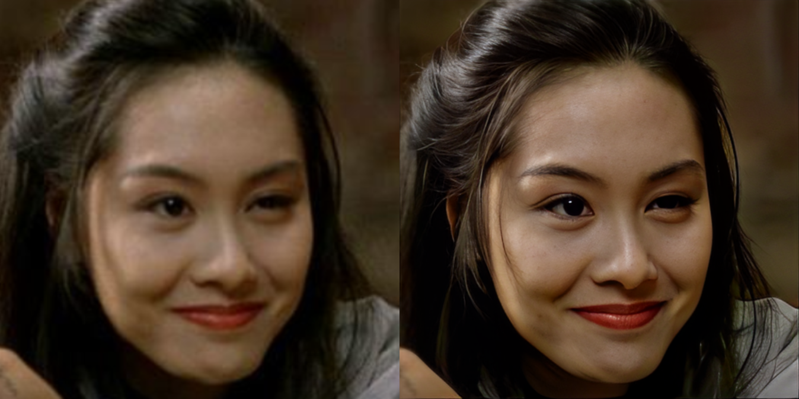
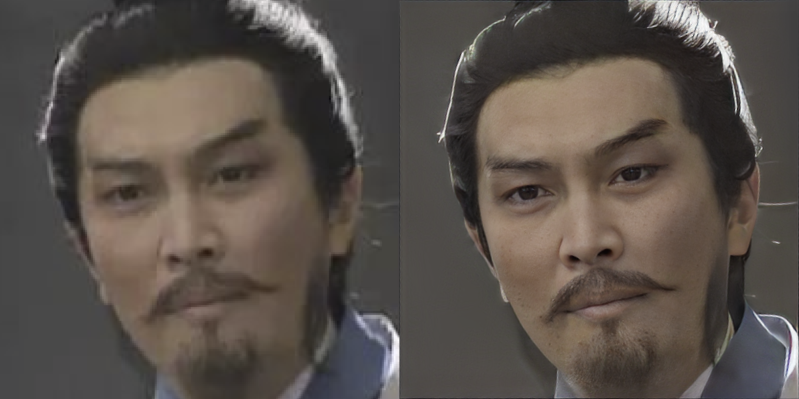
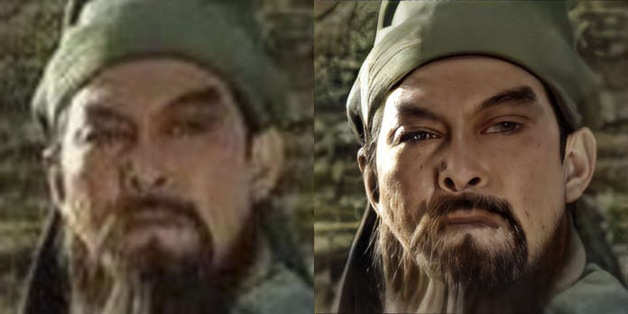
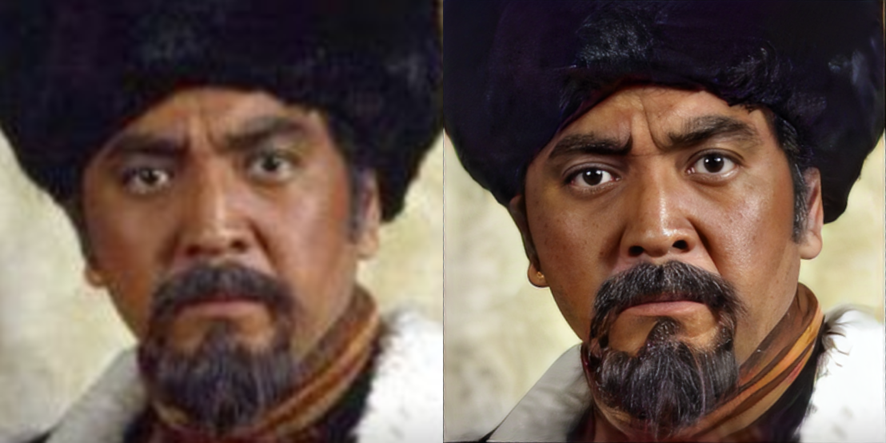
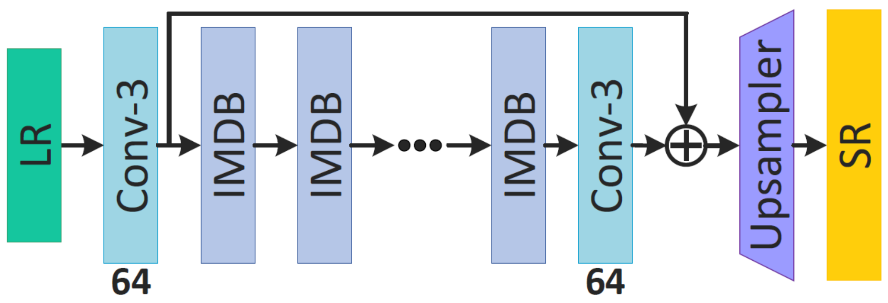
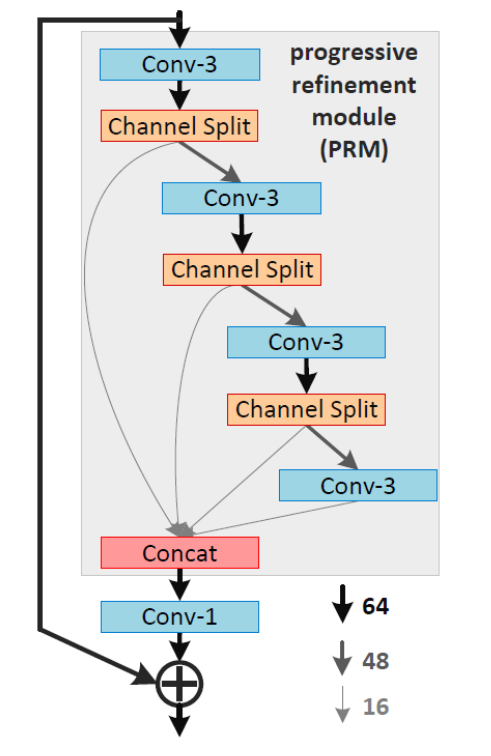

## Training and testing codes for USRNet, DnCNN, FFDNet, SRMD, DPSR, MSRResNet, ESRGAN, BSRGAN, SwinIR
[Kai Zhang](https://cszn.github.io/)

*[Computer Vision Lab](https://vision.ee.ethz.ch/the-institute.html), ETH Zurich, Switzerland*

_______
- **_News (2021-09-07)_**: We upload [the training code](https://github.com/cszn/KAIR/blob/master/docs/README_SwinIR.md) of [SwinIR ](https://github.com/JingyunLiang/SwinIR) and provide an [interactive online Colob demo for real-world image SR](https://colab.research.google.com/gist/JingyunLiang/a5e3e54bc9ef8d7bf594f6fee8208533/swinir-demo-on-real-world-image-sr.ipynb). Try to super-resolve your own images on Colab! <a href="https://colab.research.google.com/gist/JingyunLiang/a5e3e54bc9ef8d7bf594f6fee8208533/swinir-demo-on-real-world-image-sr.ipynb"></a>

|Real-World Image (x4)|[BSRGAN, ICCV2021](https://github.com/cszn/BSRGAN)|[Real-ESRGAN](https://github.com/xinntao/Real-ESRGAN)|SwinIR (ours)|
|      :---      |     :---:        |        :-----:         |        :-----:         | 
||||
|||||

- **_News (2021-08-31)_**: We upload the [training code of BSRGAN](https://github.com/cszn/BSRGAN#training).
- **_News (2021-08-24)_**: We upload the BSRGAN degradation model.
- **_News (2021-08-22)_**: Support multi-feature-layer VGG perceptual loss and UNet discriminator. 
- **_News (2021-08-18)_**: We upload the extended BSRGAN degradation model. It is slightly different from our published version. 

- **_News (2021-06-03)_**: Add testing codes of [GPEN (CVPR21)](https://github.com/yangxy/GPEN) for face image enhancement: [main_test_face_enhancement.py](https://github.com/cszn/KAIR/blob/master/main_test_face_enhancement.py)

 
 
 
 
 
 


- **_News (2021-05-13)_**: Add [PatchGAN discriminator](https://github.com/cszn/KAIR/blob/master/models/network_discriminator.py).

- **_News (2021-05-12)_**: Support distributed training, see also [https://github.com/xinntao/BasicSR/blob/master/docs/TrainTest.md](https://github.com/xinntao/BasicSR/blob/master/docs/TrainTest.md).

- **_News (2021-01)_**: [BSRGAN](https://github.com/cszn/BSRGAN) for blind real image super-resolution will be added.

- **_Pull requests are welcome!_**

- **Correction (2020-10)**: If you use multiple GPUs for GAN training, remove or comment [Line 105](https://github.com/cszn/KAIR/blob/e52a6944c6a40ba81b88430ffe38fd6517e0449e/models/model_gan.py#L105) to enable `DataParallel` for fast training

- **News (2020-10)**: Add [utils_receptivefield.py](https://github.com/cszn/KAIR/blob/master/utils/utils_receptivefield.py) to calculate receptive field.

- **News (2020-8)**: A `deep plug-and-play image restoration toolbox` is released at [cszn/DPIR](https://github.com/cszn/DPIR).

- **Tips (2020-8)**: Use [this](https://github.com/cszn/KAIR/blob/9fd17abff001ab82a22070f7e442bb5246d2d844/main_challenge_sr.py#L147) to avoid `out of memory` issue.

- **News (2020-7)**: Add [main_challenge_sr.py](https://github.com/cszn/KAIR/blob/23b0d0f717980e48fad02513ba14045d57264fe1/main_challenge_sr.py#L90) to get `FLOPs`, `#Params`, `Runtime`, `#Activations`, `#Conv`, and `Max Memory Allocated`.
```python
from utils.utils_modelsummary import get_model_activation, get_model_flops
input_dim = (3, 256, 256)  # set the input dimension
activations, num_conv2d = get_model_activation(model, input_dim)
logger.info('{:>16s} : {:<.4f} [M]'.format('#Activations', activations/10**6))
logger.info('{:>16s} : {:<d}'.format('#Conv2d', num_conv2d))
flops = get_model_flops(model, input_dim, False)
logger.info('{:>16s} : {:<.4f} [G]'.format('FLOPs', flops/10**9))
num_parameters = sum(map(lambda x: x.numel(), model.parameters()))
logger.info('{:>16s} : {:<.4f} [M]'.format('#Params', num_parameters/10**6))
```

- **News (2020-6)**: Add [USRNet (CVPR 2020)](https://github.com/cszn/USRNet) for training and testing.
  - [Network Architecture](https://github.com/cszn/KAIR/blob/3357aa0e54b81b1e26ceb1cee990f39add235e17/models/network_usrnet.py#L309)
  - [Dataset](https://github.com/cszn/KAIR/blob/6c852636d3715bb281637863822a42c72739122a/data/dataset_usrnet.py#L16)


Clone repo
----------
```
git clone https://github.com/cszn/KAIR.git
```
```
pip install -r requirement.txt
```


Training
----------

You should modify the json file from [options](https://github.com/cszn/KAIR/tree/master/options) first, for example,
setting ["gpu_ids": [0,1,2,3]](https://github.com/cszn/KAIR/blob/ff80d265f64de67dfb3ffa9beff8949773c81a3d/options/train_msrresnet_psnr.json#L4) if 4 GPUs are used,
setting ["dataroot_H": "trainsets/trainH"](https://github.com/cszn/KAIR/blob/ff80d265f64de67dfb3ffa9beff8949773c81a3d/options/train_msrresnet_psnr.json#L24) if path of the high quality dataset is `trainsets/trainH`.

- Training with `DataParallel` - PSNR


```python
python main_train_psnr.py --opt options/train_msrresnet_psnr.json
```

- Training with `DataParallel` - GAN

```python
python main_train_gan.py --opt options/train_msrresnet_gan.json
```

- Training with `DistributedDataParallel` - PSNR - 4 GPUs

```python
python -m torch.distributed.launch --nproc_per_node=4 --master_port=1234 main_train_psnr.py --opt options/train_msrresnet_psnr.json  --dist True
```

- Training with `DistributedDataParallel` - PSNR - 8 GPUs

```python
python -m torch.distributed.launch --nproc_per_node=8 --master_port=1234 main_train_psnr.py --opt options/train_msrresnet_psnr.json  --dist True
```

- Training with `DistributedDataParallel` - GAN - 4 GPUs

```python
python -m torch.distributed.launch --nproc_per_node=4 --master_port=1234 main_train_gan.py --opt options/train_msrresnet_gan.json  --dist True
```

- Training with `DistributedDataParallel` - GAN - 8 GPUs

```python
python -m torch.distributed.launch --nproc_per_node=8 --master_port=1234 main_train_gan.py --opt options/train_msrresnet_gan.json  --dist True
```

- Kill distributed training processes of `main_train_gan.py`

```python
kill $(ps aux | grep main_train_gan.py | grep -v grep | awk '{print $2}')
```

----------
| Method | Original Link |
|---|---|
| DnCNN |[https://github.com/cszn/DnCNN](https://github.com/cszn/DnCNN)|
| FDnCNN |[https://github.com/cszn/DnCNN](https://github.com/cszn/DnCNN)|
| FFDNet | [https://github.com/cszn/FFDNet](https://github.com/cszn/FFDNet)|
| SRMD | [https://github.com/cszn/SRMD](https://github.com/cszn/SRMD)|
| DPSR-SRResNet | [https://github.com/cszn/DPSR](https://github.com/cszn/DPSR)|
| SRResNet | [https://github.com/xinntao/BasicSR](https://github.com/xinntao/BasicSR)|
| ESRGAN | [https://github.com/xinntao/ESRGAN](https://github.com/xinntao/ESRGAN)|
| RRDB | [https://github.com/xinntao/ESRGAN](https://github.com/xinntao/ESRGAN)|
| IMDB | [https://github.com/Zheng222/IMDN](https://github.com/Zheng222/IMDN)|
| USRNet | [https://github.com/cszn/USRNet](https://github.com/cszn/USRNet)|
| DRUNet | [https://github.com/cszn/DPIR](https://github.com/cszn/DPIR)|
| DPIR | [https://github.com/cszn/DPIR](https://github.com/cszn/DPIR)|
| BSRGAN | [https://github.com/cszn/BSRGAN](https://github.com/cszn/BSRGAN)|
| SwinIR | [https://github.com/JingyunLiang/SwinIR](https://github.com/JingyunLiang/SwinIR)|

Network architectures
----------
* [USRNet](https://github.com/cszn/USRNet)

   

* DnCNN

   
 
* IRCNN denoiser

  

* FFDNet

   

* SRMD

   

* SRResNet, SRGAN, RRDB, ESRGAN

   
  
* IMDN

    -----  


Testing
----------
|Method | [model_zoo](model_zoo)|
|---|---|
| [main_test_dncnn.py](main_test_dncnn.py) |```dncnn_15.pth, dncnn_25.pth, dncnn_50.pth, dncnn_gray_blind.pth, dncnn_color_blind.pth, dncnn3.pth```|
| [main_test_ircnn_denoiser.py](main_test_ircnn_denoiser.py) | ```ircnn_gray.pth, ircnn_color.pth```| 
| [main_test_fdncnn.py](main_test_fdncnn.py) | ```fdncnn_gray.pth, fdncnn_color.pth, fdncnn_gray_clip.pth, fdncnn_color_clip.pth```|
| [main_test_ffdnet.py](main_test_ffdnet.py) | ```ffdnet_gray.pth, ffdnet_color.pth, ffdnet_gray_clip.pth, ffdnet_color_clip.pth```|
| [main_test_srmd.py](main_test_srmd.py) | ```srmdnf_x2.pth, srmdnf_x3.pth, srmdnf_x4.pth, srmd_x2.pth, srmd_x3.pth, srmd_x4.pth```| 
|  | **The above models are converted from MatConvNet.** |
| [main_test_dpsr.py](main_test_dpsr.py) | ```dpsr_x2.pth, dpsr_x3.pth, dpsr_x4.pth, dpsr_x4_gan.pth```|
| [main_test_msrresnet.py](main_test_msrresnet.py) | ```msrresnet_x4_psnr.pth, msrresnet_x4_gan.pth```|
| [main_test_rrdb.py](main_test_rrdb.py) | ```rrdb_x4_psnr.pth, rrdb_x4_esrgan.pth```|
| [main_test_imdn.py](main_test_imdn.py) | ```imdn_x4.pth```|

[model_zoo](model_zoo)
--------
- download link [https://drive.google.com/drive/folders/13kfr3qny7S2xwG9h7v95F5mkWs0OmU0D](https://drive.google.com/drive/folders/13kfr3qny7S2xwG9h7v95F5mkWs0OmU0D)

[trainsets](trainsets)
----------
- [https://github.com/xinntao/BasicSR/blob/master/docs/DatasetPreparation.md](https://github.com/xinntao/BasicSR/blob/master/docs/DatasetPreparation.md)
- [train400](https://github.com/cszn/DnCNN/tree/master/TrainingCodes/DnCNN_TrainingCodes_v1.0/data)
- [DIV2K](https://data.vision.ee.ethz.ch/cvl/DIV2K/)
- [Flickr2K](https://cv.snu.ac.kr/research/EDSR/Flickr2K.tar)
- optional: use [split_imageset(original_dataroot, taget_dataroot, n_channels=3, p_size=512, p_overlap=96, p_max=800)](https://github.com/cszn/KAIR/blob/3ee0bf3e07b90ec0b7302d97ee2adb780617e637/utils/utils_image.py#L123) to get ```trainsets/trainH``` with small images for fast data loading

[testsets](testsets)
-----------
- [https://github.com/xinntao/BasicSR/blob/master/docs/DatasetPreparation.md](https://github.com/xinntao/BasicSR/blob/master/docs/DatasetPreparation.md)
- [set12](https://github.com/cszn/FFDNet/tree/master/testsets)
- [bsd68](https://github.com/cszn/FFDNet/tree/master/testsets)
- [cbsd68](https://github.com/cszn/FFDNet/tree/master/testsets)
- [kodak24](https://github.com/cszn/FFDNet/tree/master/testsets)
- [srbsd68](https://github.com/cszn/DPSR/tree/master/testsets/BSD68/GT)
- set5
- set14
- cbsd100
- urban100
- manga109


References
----------
```BibTex
@inproceedings{liang2021swinir,
title={SwinIR: Image Restoration Using Swin Transformer},
author={Liang, Jingyun and Cao, Jiezhang and Sun, Guolei and Zhang, Kai and Van Gool, Luc and Timofte, Radu},
booktitle={IEEE International Conference on Computer Vision Workshops},
year={2021}
}
@inproceedings{zhang2021designing,
title={Designing a Practical Degradation Model for Deep Blind Image Super-Resolution},
author={Zhang, Kai and Liang, Jingyun and Van Gool, Luc and Timofte, Radu},
booktitle={IEEE International Conference on Computer Vision},
year={2021}
}
@article{zhang2021plug, % DPIR & DRUNet & IRCNN
  title={Plug-and-Play Image Restoration with Deep Denoiser Prior},
  author={Zhang, Kai and Li, Yawei and Zuo, Wangmeng and Zhang, Lei and Van Gool, Luc and Timofte, Radu},
  journal={IEEE Transactions on Pattern Analysis and Machine Intelligence},
  year={2021}
}
@inproceedings{zhang2020aim, % efficientSR_challenge
  title={AIM 2020 Challenge on Efficient Super-Resolution: Methods and Results},
  author={Kai Zhang and Martin Danelljan and Yawei Li and Radu Timofte and others},
  booktitle={European Conference on Computer Vision Workshops},
  year={2020}
}
@inproceedings{zhang2020deep, % USRNet
  title={Deep unfolding network for image super-resolution},
  author={Zhang, Kai and Van Gool, Luc and Timofte, Radu},
  booktitle={IEEE Conference on Computer Vision and Pattern Recognition},
  pages={3217--3226},
  year={2020}
}
@article{zhang2017beyond, % DnCNN
  title={Beyond a gaussian denoiser: Residual learning of deep cnn for image denoising},
  author={Zhang, Kai and Zuo, Wangmeng and Chen, Yunjin and Meng, Deyu and Zhang, Lei},
  journal={IEEE Transactions on Image Processing},
  volume={26},
  number={7},
  pages={3142--3155},
  year={2017}
}
@inproceedings{zhang2017learning, % IRCNN
title={Learning deep CNN denoiser prior for image restoration},
author={Zhang, Kai and Zuo, Wangmeng and Gu, Shuhang and Zhang, Lei},
booktitle={IEEE conference on computer vision and pattern recognition},
pages={3929--3938},
year={2017}
}
@article{zhang2018ffdnet, % FFDNet, FDnCNN
  title={FFDNet: Toward a fast and flexible solution for CNN-based image denoising},
  author={Zhang, Kai and Zuo, Wangmeng and Zhang, Lei},
  journal={IEEE Transactions on Image Processing},
  volume={27},
  number={9},
  pages={4608--4622},
  year={2018}
}
@inproceedings{zhang2018learning, % SRMD
  title={Learning a single convolutional super-resolution network for multiple degradations},
  author={Zhang, Kai and Zuo, Wangmeng and Zhang, Lei},
  booktitle={IEEE Conference on Computer Vision and Pattern Recognition},
  pages={3262--3271},
  year={2018}
}
@inproceedings{zhang2019deep, % DPSR
  title={Deep Plug-and-Play Super-Resolution for Arbitrary Blur Kernels},
  author={Zhang, Kai and Zuo, Wangmeng and Zhang, Lei},
  booktitle={IEEE Conference on Computer Vision and Pattern Recognition},
  pages={1671--1681},
  year={2019}
}
@InProceedings{wang2018esrgan, % ESRGAN, MSRResNet
    author = {Wang, Xintao and Yu, Ke and Wu, Shixiang and Gu, Jinjin and Liu, Yihao and Dong, Chao and Qiao, Yu and Loy, Chen Change},
    title = {ESRGAN: Enhanced super-resolution generative adversarial networks},
    booktitle = {The European Conference on Computer Vision Workshops (ECCVW)},
    month = {September},
    year = {2018}
}
@inproceedings{hui2019lightweight, % IMDN
  title={Lightweight Image Super-Resolution with Information Multi-distillation Network},
  author={Hui, Zheng and Gao, Xinbo and Yang, Yunchu and Wang, Xiumei},
  booktitle={Proceedings of the 27th ACM International Conference on Multimedia (ACM MM)},
  pages={2024--2032},
  year={2019}
}
@inproceedings{zhang2019aim, % IMDN
  title={AIM 2019 Challenge on Constrained Super-Resolution: Methods and Results},
  author={Kai Zhang and Shuhang Gu and Radu Timofte and others},
  booktitle={IEEE International Conference on Computer Vision Workshops},
  year={2019}
}
@inproceedings{yang2021gan,
    title={GAN Prior Embedded Network for Blind Face Restoration in the Wild},
    author={Tao Yang, Peiran Ren, Xuansong Xie, and Lei Zhang},
    booktitle={IEEE Conference on Computer Vision and Pattern Recognition},
    year={2021}
}
```
